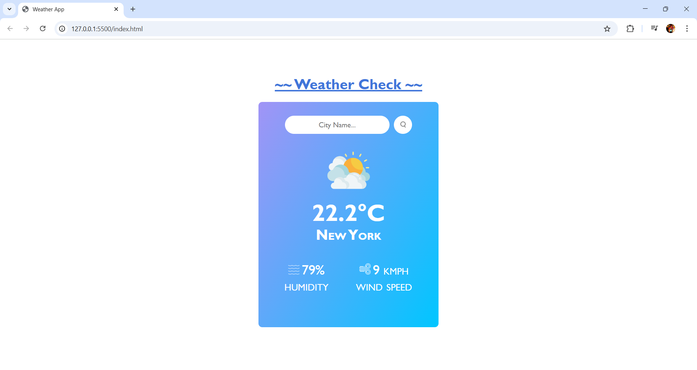

# 🌤️ Weather App

A simple and responsive weather application that fetches real-time weather data using the [WeatherAPI](https://www.weatherapi.com/).  
You can search any city and get details like **temperature**, **humidity**, **wind speed**, and weather conditions with an appropriate icon.

---

## ✨ Features
- Search weather by city name.
- Displays:
  - Temperature in °C
  - Humidity %
  - Wind speed (km/h)
  - Weather condition with matching icon.
- Supports search via **button click** or **Enter key**.
- Error handling for invalid city names.
- Dynamic weather icons for different conditions.

---

## 🛠️ Tech Stack
- **HTML5**
- **CSS3** (Linear gradient background)
- **JavaScript (Vanilla JS)**
- **WeatherAPI**

---

## 📸 Screenshots

### Home Page (Default State)


### Weather Result Example


---

## ⚙️ Setup & Installation
 **Clone this repository**  
   ```bash
   git clone https://github.com/manavsagar46/weatherApp.git
